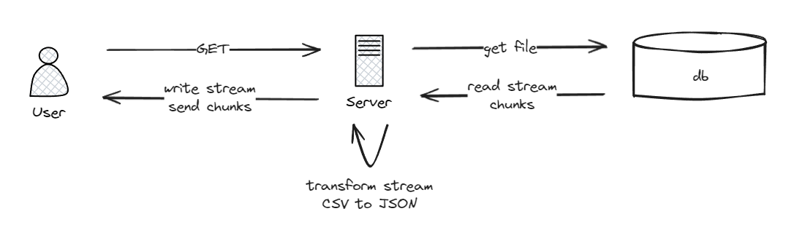
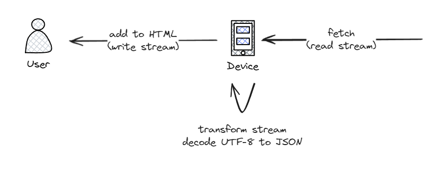

# Processing Gigabytes of data in the server and browser

Getting large datas from the back end, converting from csv to JSON and displaying it to the user in the front end. I built the side project for learning purposes, following the video from Erick Wendel.

## 📦 Technologies

- `Node@20.0.9`
- `csvtojson`

## 🎈 Features

Here's what you can do with this project: 

- **Start reading file**: Sends a request to read a list of all animes from 1990 to 2022, and displays only the title, description and link to the screen on demand.
- **Stop**: Abort the request and stop displaying to the screen.
- **Resume reading (TODO)**: Resume the file read from where it stopped.

## 💭 How was it built

### Server side

I started downloading and saving the list of animes on Kaggle. It was going to be used as the data source file.

Next, I built the server that was going to read this large data, process it (convert from CSV to JSON, and extract selected data) and send to the client. It could not be done with coventional read file from node, but with **streams**.

In the server, the **Read Stream** reads the CSV file chunk by chunk and send them to the **Transform Stream**. This stream transform those chunks by converting
from CSV to JSON **and** extracting only the data that we want, such as anime title, description and link.

The Transform Stream send the transformed chunk to the **Write Stream**, to which, finally, send the desired data to the client. Bit by Bit.



### Client side

The client can consume the API. It works by sending a request to the server, and it will receive the data in chunks (via a **Readable Stream**) encoded in Newline Delimited JSON (NDJSON). The chunk will be decoded to string and parsed to JSON by a **Transform Stream**. 

Finally, with the JSON data in hands, a **Write Stream** will display to the client.



### Tldr

Servers reads data from source -> Transform it -> Send to client

Browser reads data from server -> Transform it -> Display in HTML

Read -> Transform -> Write

## 📚 What I Learned

During this project, I've picked up important skills and a better understanding of complex ideas, which improved my logical thinking.

### When to use Node.js Stream and Web Stream API

Node.js Streams and Web Streams APIs are both used for handling streaming data, but they are used in different scenarios and have different features.

Node.js Streams are typically used in server-side development, especially when dealing with large amounts of data. They provide a way to handle streaming data, allowing you to work with large files or network connections without consuming a lot of memory. Node.js Streams also provide features like backpressure, which helps prevent overloading the system by controlling the rate of data flow [Source 3](https://nodejs.org/api/stream.html).

Here's an example of creating a Readable Stream in Node.js:

```javascript
const fs = require('fs');
const readStream = fs.createReadStream('input.txt');
readStream.on('data', (chunk) => {
 console.log(chunk);
});
```

On the other hand, Web Streams APIs are part of the browser's standard library and are used for handling streaming data in client-side development. They provide a consistent interface for working with streams of data, whether they come from network requests, file inputs, or other sources. Web Streams APIs also support features like asynchronous iteration and transferring streams between workers [Source 2](https://developer.mozilla.org/en-US/docs/Web/API/Streams_API).

Here's an example of creating a ReadableStream in the browser:

```javascript
const response = await fetch('https://example.com/file.txt');
const reader = response.body.getReader();
let result = '';
while (true) {
 const { done, value } = await reader.read();
 if (done) break;
 result += new TextDecoder("utf-8").decode(value);
}
console.log(result);
```

In summary, use Node.js Streams when you're working with server-side data handling, particularly with large data sets or network connections. Use Web Streams APIs when you're working with client-side data handling, including handling streams of data from network requests or file inputs.

### Dealing with CORS without frameworks

Letting anyone in anyway access the server.

```javascript
createServer(async (request, response) => {
  const headers = {
    "Access-Control-Allow-Origin": "*",
    "Access-Control-Allow-Methods": "*",
  };

  response.writeHead(/* statusCode */, headers)
})
```

### Stream

- Readable is the input of the file, Transform in the process and Writable is the output.
- pipeThrough() is the transform step. Can use many times necessary.
- pipeTo() is the last step. Can use only once.

Read -> Process -> Write

### Converting node stream to web stream

`Readable.toWeb()` converts the nodejs stream (that doesn't work on the frontend) to web stream. The browser can only manipulate web streams.

```javascript
import { createReadStream } from "node:fs";
import { Readable } from "node:stream";

// ...

Readable.toWeb(createReadStream("pathToFile.csv"))
```

### setTimeout in promise instead of callback

You can use the `setTimout` as a promise instead of callback by importing it from node `node:timers/promises`. It has a much cleaner syntax: 

```javascript
import { setTimeout } from "node:timers/promises";

async function usingPromise() {
  await setTimeout(1000); // time out for one second
}
```

### http 204 status code

`204 No Content` status code does NOT send data to the requester. I was stuck because of this, without receiving any data at all from the server. 

Learned the hard way...

## 🚦 Running the project

1. Clone the repository to your local machine.
2. Run `npm install` in the server directory to install the required dependencies.
3. Run `npm run start` to open the server.
4. Open another bash and run `npm install` to the app directory.
5. Run `npm run dev` to open the app. 

## Errors

### Cannot find modules node:internal/modules/cjs/loader:1051

It happens when trying to run node test runner with `node test` INSTEAD OF `node --test` which is the correct command.

## Sources

- [Como ler 10GB de JSON no frontend sem travar a tela || Webstreams 101 || Erick Wendel](https://www.youtube.com/watch?v=-IpRYbL4yMk)
- [List of anime from 1990 to 2022](https://www.kaggle.com/datasets/danielalbarracinm/list-of-anime-from-1990-to-2022?resource=download)
- [Streams - Node.js v20.11.0 documentation](https://nodejs.org/docs/latest-v20.x/api/stream.html)
- [Web Streams - Node.js v20.11.0 documentation](https://nodejs.org/docs/latest-v20.x/api/webstreams.html)
- [TextDecoderStream  - WEB APIs | MDN](https://developer.mozilla.org/en-US/docs/Web/API/TextDecoderStream)
- [204 No Content  - WEB APIs | MDN](https://developer.mozilla.org/pt-BR/docs/Web/HTTP/Status/204)
- [Timers - Node.js v21.5.0 documentation](https://nodejs.org/api/timers.html#timerspromisessettimeoutdelay-value-options)
- [NDJSON](https://ndjson.org/)
- [AbortController - WEB APIs | MDN](https://developer.mozilla.org/en-US/docs/Web/API/AbortController)